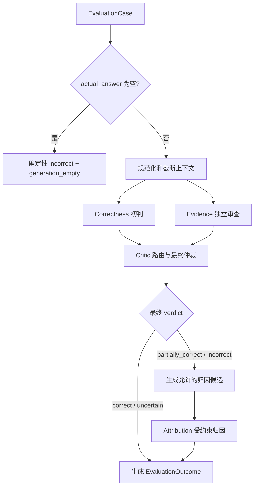

# RAG 评估架构

本文说明 `nianlun.evaluation` 当前实现的架构、语义边界和稳定契约。安装、CLI
参数、输入示例、Excel 导出和断点续跑操作见
[RAG Evaluation 使用说明](../../nianlun/evaluation/README.md)。字段的精确类型和校验规则
以 `nianlun/evaluation/contracts/` 与各阶段的 `schema.py` 为准。

## 1. 范围

评估模块面向离线 RAG 结果，不依赖被评系统的 Agent、路由、重排、工具调用或索引实现。
每个被评系统通过 Adapter 提供四项公共输入，评估器据此判断：

- 实际回答是否正确、完整；
- 标准答案是否适合作为判断基准；
- 检索内容对题目、标准答案和实际回答提供了什么证据；
- 回答存在实质问题时，最可能属于检索侧还是生成侧问题。

当前实现不做以下事情：

- 不读取或评估被评系统的内部执行轨迹；
- 不修改回答、检索策略或提示词；
- 不把类别任意映射为综合分；
- 不把 Judge 的归因当作已经证明的真实因果链；
- 不把 Judge 自报置信度解释为统计学概率；
- 不在普通单元测试中调用真实模型或外部服务。

## 2. 设计原则

### 2.1 输入保持通用

核心评估器只接收问题、标准答案、实际回答和最终检索内容。系统名、数据集标签、业务主键、
耗时和内部轨迹不得进入 `EvaluationCase`，需要时由调用方通过 sidecar 关联。

### 2.2 事实判断与错误归因分离

Evidence 阶段描述检索内容覆盖、噪声、冲突和 claim 支持度，不判断回答对错，也不诊断根因。
Attribution 阶段只在最终回答存在问题时运行，根据已确认的 verdict 和证据观测选择归因。

### 2.3 初判可以被推翻

Correctness 阶段不读取检索上下文，避免检索结果先入为主。Critic 随后结合原始输入、初判和
证据观测进行最终仲裁。当前配置固定为 `critic_policy="always"`，不存在未经校准的快速路径。

### 2.4 确定性逻辑由代码承担

字段校验、上下文 ID、上下文截断、空回答、调用统计、支持度聚合、路由候选和指纹均由代码
处理。语义等价、证据充分性、事实冲突、答案质量和错误归因交给 Judge。

### 2.5 不确定是有效结果

标准答案存在缺陷、证据冲突无法消解或现有输入不足时，评估器允许输出 `uncertain` 或
`unknown`。模型调用或结构化输出失败属于评估失败，不得转换成不确定结论。

## 3. 输入契约

### 3.1 EvaluationCase

`EvaluationCase` 顶层严格包含以下字段，额外字段会被拒绝：

| 字段 | 类型 | 约束与语义 |
| --- | --- | --- |
| `question` | `str` | 非空；用户提出的问题 |
| `reference_answer` | `str` | 非空；用于比较的标准答案 |
| `actual_answer` | `str` | 必须存在；允许为空字符串 |
| `retrieval_contexts` | `list[ContextItem]` | 必须存在；空列表表示没有检索结果 |

空的 `actual_answer` 是有效的被评结果，不是输入错误。非空拒答，例如“无法回答”，仍进入语义
评估。`retrieval_contexts=null` 或字段缺失属于无效输入；只有空列表表示检索结果为空。

### 3.2 ContextItem

| 字段 | 必需 | 用途 |
| --- | --- | --- |
| `text` | 是 | 非空的检索文本 |
| `context_id` | 否 | 模型输出引用的上下文标识 |
| `source_id` | 否 | 来源文档或记录标识 |
| `source_name` | 否 | 人类可读的来源名称 |
| `location` | 否 | 页码、节点或行号等定位信息 |
| `score` | 否 | 被评系统的原始检索分数 |

评估器不解释 `score` 的量纲或阈值。缺少 `context_id` 时，规范化阶段按输入顺序生成稳定的
`ctx-N`；重复 ID 会使该 case 在 validation 阶段失败。模型只能引用规范化后存在的 ID。

### 3.3 Adapter 边界

Adapter 只负责把外部记录转换为 `EvaluationCase`，核心评估器不反向依赖 Adapter。
Nianlun Adapter 的主要映射如下：

| Nianlun 字段 | 公共字段 |
| --- | --- |
| `question` | `question` |
| `expected_answer` | `reference_answer` |
| `agent_answer` | `actual_answer` |
| `retrieved_snippets[].text` | `retrieval_contexts[].text` |
| `citation_id` | `context_id` |
| `doc_id` / `doc_name` | `source_id` / `source_name` |
| `node_id` + `line_spec` | `location` |

`source_record`、模型耗时和 Agent 内部状态不进入公共 Case。

## 4. 执行流程



Correctness 与 Evidence 并行调用。Critic 必定在二者成功后调用。Attribution 是否调用由最终
verdict 决定。因此，一个普通非空 case 有 3 次逻辑阶段调用；需要归因时有 4 次。逻辑调用
次数不等于供应商请求次数，结构化输出重试和语义重试会增加 `model_attempts`。

### 4.1 校验、规范化和截断

非空回答先规范化上下文，再按 `max_context_items` 和 `max_context_chars` 保留有界输入。
只要发生截断，`run_logs.input_stats.contexts_truncated` 就为 `true`。此时归因候选固定为
`unknown`，避免把评估器自身丢弃的证据误判为被评系统的检索问题。

case fingerprint 基于规范化后的四字段输入生成。由于截断是评估器行为，fingerprint 使用截断前
的规范化 Case，使同一个原始输入具有稳定身份。

### 4.2 空回答

当 `actual_answer.strip()` 为空时，代码直接返回：

- `correctness.value=incorrect`；
- `attribution.value=generation_empty`；
- `attribution_strength=strong`；
- `reference_quality=null`、`evidence=null`；
- Judge 调用数和所有模型重试统计为 0。

该分支仍保留输入检索条数，但不规范化、截断或语义审查检索内容。

### 4.3 Correctness

Correctness 只接收 `question`、`reference_answer` 和 `actual_answer`，同时输出答案初判与标准答案
质量。它按语义而非措辞比较，不因表达简洁、格式不同或缺少可选细节降级。

答案 verdict：

| 值 | 含义 |
| --- | --- |
| `correct` | 满足核心要求且没有实质事实或逻辑错误 |
| `partially_correct` | 中心答案基本正确且可用，但有实质性的局部错误或次要遗漏 |
| `incorrect` | 中心结论错误、主要要求未回答，或缺陷使答案产生实质误导 |
| `uncertain` | 现有输入无法消除影响核心结论的歧义 |

标准答案质量：

| 值 | 含义 |
| --- | --- |
| `adequate` | 足以且适合用于判断问题 |
| `incomplete` | 可用，但缺少判断核心要求所需的信息 |
| `conflicting` | 存在实质内部冲突，或与问题本身冲突 |
| `unknown` | 无法从输入判断其质量 |

`matched_facts`、`missing_facts` 和 `incorrect_claims` 是 verdict 的事实依据，不是错误归因。

### 4.4 Evidence

Evidence 只把 `retrieval_contexts` 当作证据。问题和两个答案用于识别待检查的必要事实与 claim，
但答案之间互相一致不构成证据。

| 指标 | 取值 | 含义 |
| --- | --- | --- |
| `retrieval_coverage` | `none/partial/full/uncertain` | 上下文是否包含回答问题必需的信息 |
| `retrieval_noise` | `none/limited/substantial/uncertain` | 无关或误导内容是否妨碍使用有效证据 |
| `evidence_consistency` | `consistent/conflicting/uncertain` | 必要事实是否存在同范围、同条件下的实质冲突 |
| claim support | `full/partial/none/conflicting/uncertain` | 单个事实断言受到上下文支持的程度 |

Evidence 分别拆解标准答案和实际回答的实质性 claim，输出
`reference_claim_assessments` 与 `actual_claim_assessments`。每条 claim 的
`context_ids` 语义由支持度决定：

- `full`、`partial` 引用支持该 claim 的上下文；
- `conflicting` 引用直接否定该 claim 的上下文；
- `none`、`uncertain` 不引用上下文。

模型输出使用 `EvidenceModelOutput`，不包含 `reference_answer_support` 和
`actual_answer_support`。代码根据 claim 明细派生这两个答案级聚合值和引用 ID 并组装
`EvidenceResult`，避免要求模型重复输出可计算数据。

聚合优先级为：存在 `conflicting` 则聚合为 `conflicting`；否则存在 `uncertain` 则为
`uncertain`；全为 `full` 或全为 `none` 时分别得到对应值；其余组合为 `partial`。没有 claim
时固定为 `uncertain`。答案级 `context_ids` 是所有 claim 引用的有序去重并集。

“没有支持”与“被否定”必须区分：`none` 只说明当前检索内容没有提供依据；`conflicting`
要求检索内容直接形成否定证据。只有措辞、条件、时间或范围不同，不足以判定冲突。

### 4.5 Critic

Critic 接收原始 Case、Correctness 初判和 Evidence 观测，重新产出完整的最终 correctness 与
reference quality。初判和证据聚合都是待验证信息，不具有优先权。

路由由代码按优先级选择一个审查重点；路由只改变附加检查规则，不限制最终 verdict：

| 路由 | 触发重点 | 审查目的 |
| --- | --- | --- |
| `reference_challenge` | 标准答案质量异常或其关键 claim 与证据冲突 | 避免把有缺陷的标准答案当作绝对真值 |
| `false_negative_recovery` | 初判非正确，但实际回答得到充分且一致的证据支持 | 检查语义等价或初判过严 |
| `false_positive_correction` | 初判正确，但实际回答缺少支持或受到冲突证据影响 | 检查表面匹配掩盖的实质错误 |
| `evidence_conflict_resolution` | 检索证据冲突或无法稳定判断 | 确认冲突是否真正影响核心答案 |
| `severity_boundary_correction` | 非正确初判伴随局部支持或冲突 | 校准 `partially_correct` 与 `incorrect` 边界 |
| `general` | 未命中上述条件 | 对初判做通用反证检查 |

路由还记录 `reference_quality_issue`、`verdict_evidence_tension`、`evidence_conflict` 和
`contexts_truncated` flags，用于审计和汇总，不直接决定最终答案。

Critic 判断答案完整性时只考虑问题明确要求或必然隐含的内容。用户未要求的限制说明、来源
讨论、证据分析、排除过程和背景知识，不得被视为答案缺失。

### 4.6 Attribution

只有最终 verdict 为 `partially_correct` 或 `incorrect` 时才进行归因。代码根据证据和 verdict
生成允许候选，模型只能从候选中选择一个主要原因；`secondary_issues` 只记录有独立证据且
对缺陷有实质贡献的次要问题。

| 类别 | 边界 |
| --- | --- |
| `retrieval_missing` | 没有检索到任何回答必需的证据 |
| `retrieval_incomplete` | 只检索到部分必需证据，缺失内容可解释回答缺陷 |
| `retrieval_noise` | 可定位的无关、误导或冲突上下文直接影响了回答 |
| `generation_empty` | 实际回答为空，由代码确定性生成 |
| `generation_incomplete` | 必需证据已存在，但回答遗漏了关键事实 |
| `hallucination` | 回答引入无依据或被检索证据否定的事实断言 |
| `reasoning_error` | 必需事实已存在，但计算、比较、推断或时序处理错误 |
| `unknown` | 根据现有输入无法可靠区分原因 |

`retrieval_missing` 与 `retrieval_incomplete` 的边界是：前者没有任何回答必需的证据，后者至少
覆盖了一部分必要事实。检索列表非空不等于检索有效；若内容完全不包含必要事实，coverage
仍为 `none`，可归因 `retrieval_missing`。

主要归因强度：

| 值 | 含义 |
| --- | --- |
| `strong` | 直接、具体证据足以排除有实质意义的竞争解释 |
| `plausible` | 证据倾向该归因，但仍存在有意义的替代解释 |
| `insufficient` | 无法可靠归因，只能与 `unknown` 组合 |

归因为 hallucination 时必须提供 `hallucinated_claims`。其中 `unsupported` 表示当前材料无
支持，不能据此断言现实世界中为假；`contradicted` 表示检索上下文直接否定该断言，必须引用
相应 `context_ids`。标准答案否定该断言只能作为补充信息，不能单独建立 `contradicted`。

`omitted_facts`、`reasoning_errors` 和 `noise_context_ids` 分别记录已确认的关键遗漏、可追溯的
推理错误和直接导致缺陷的噪声上下文。没有对应事实时保持空列表。

## 5. 输出契约

### 5.1 EvaluationOutcome

单个 case 的公开结果由以下部分组成：

| 字段 | 语义 |
| --- | --- |
| `evaluation_status` | `completed` 或 `failed` |
| `correctness` | 最终答案 verdict、理由和事实明细 |
| `reference_quality` | 最终标准答案质量 |
| `evidence` | 证据观测与 claim 明细 |
| `attribution` | 错误归因；仅非正确的可判定答案存在 |
| `run_logs` | 版本、路由、调用、重试、耗时和阶段记录 |
| `error` | 失败阶段的脱敏错误信息 |

完成结果只在顶层保留最终 assessment。`run_logs.correctness_result` 保存 Critic 之前的初判；
成功结果不会在 `run_logs` 中重复最终 Evidence 或 Critic 内容。阶段失败时，日志可以保留此前
已经成功的中间结果，以便定位失败点。

失败结果必须有 `error`，且所有最终 assessment 都为 `null`。不能把部分完成的中间结果包装成
最终结论。

### 5.2 MetricAssessment

可独立解释的指标继承统一的 `MetricAssessment[value, reason]`，再增加各自的事实或引用字段。
`EvidenceResult` 是多个指标的集合，`CriticResult` 是纠错阶段结果，二者不额外产生总分。

字段的精确约束不在本文复制。修改公共模型时必须同步检查：

- `contracts/outcome.py` 的跨字段不变量；
- 阶段的 prompt 与语义校验；
- `reporting/summary.py` 和 `reporting/excel.py`；
- JSONL 恢复兼容性及相关测试。

### 5.3 JSONL envelope

批处理输出每行只使用以下一种 envelope：

- 成功执行：`{"input_line": N, "result": EvaluationOutcome}`；
- 输入或任务错误：`{"input_line": N, "error": {...}}`；
- 已完成重复项：`{"input_line": N, "skipped": {...}}`。

JSONL 是完整、可审计的机器结果。Excel 是供人工浏览的精简视图，只导出问题、两个答案、
最终 verdict/attribution 及其 reason、状态和错误码，不替代 JSONL。

## 6. 结构化调用与失败语义

所有模型阶段通过 `EvaluationRuntime` 生成 Pydantic 结构化输出。模型适配层负责严格解析、JSON
修复、schema retry 和供应商调用 retry；阶段级语义校验失败时，runtime 使用带错误摘要的纠正
提示词重试，次数由 `max_semantic_retries` 控制。

任何阶段在重试后仍失败，整个 case 标记为 `failed`，并记录：

- 失败阶段和稳定错误码；
- 是否可重试；
- 已发生的逻辑调用、模型请求和 token 用量；
- 结构化解析、schema 和语义重试次数。

公开错误信息不得包含完整模型请求、检索正文、API key 或供应商敏感响应。

## 7. 版本、指纹与恢复

当前评估协议版本由 `orchestration/pipeline.py` 中的 `EVALUATION_VERSION` 定义。提示词和 Critic
路由分别独立版本化，并写入 `run_logs.prompt_versions` 与 `routing_version`。

`case_fingerprint` 标识规范化后的四字段输入。`evaluator_fingerprint` 覆盖会影响行为的配置，
包括：

- 评估和路由版本；
- 各阶段提示词版本；
- 输入、输出及阶段 Schema；
- Judge 模型元数据和模型行为配置；
- 上下文限制、温度和重试配置。

批处理采用追加写入。只有 `case_fingerprint` 与当前 `evaluator_fingerprint` 都匹配的已完成记录
才会跳过；失败记录会重新评估。读取含多次运行的结果文件时，应按 case fingerprint 使用最后
一条有效记录。汇总器拒绝混合不同 evaluator fingerprint 的结果。

## 8. 依赖与模块职责

```text
nianlun/evaluation/
  contracts/       公共 Case、Outcome、枚举、运行日志和汇总契约
  adapters/        外部 RAG 记录到 EvaluationCase 的显式转换
  stages/          correctness、evidence、critic、attribution
  judge/           共享结构化模型调用、重试和 telemetry
  orchestration/   阶段编排、确定性规则、版本和指纹
  reporting/       批量汇总与精简 Excel 导出
  batch.py         有界并发、JSONL 追加写入与恢复
  cli.py           命令行参数与依赖装配
```

依赖方向为：CLI/批处理调用 orchestration；orchestration 依赖 contracts、stages 和 judge；stage
依赖公共 contracts，但 contracts 不依赖 CLI、Adapter 或具体模型供应商。外部系统差异只能进入
Adapter 或模型适配层，不得渗入核心 Case 和评估规则。

## 9. 汇总边界

`EvaluationSummary` 只统计评估器内部可观察的数据，包括 verdict、证据指标、归因、Critic
路由与推翻情况、失败率、调用量、token、重试和总耗时。没有外部人工标签时，不输出准确率、
召回率或“Judge 正确率”等指标。

模型、提示词或策略变更的质量必须在独立人工标注集上校准。线上批量统计只能说明当前评估器
如何判断数据，不能证明这些判断与人工真值一致。

## 10. 维护与验证

修改 prompt、路由、Schema 或 middleware 属于行为变更。至少检查以下不变量：

- 四字段 Case 继续拒绝额外字段和重复 context ID；
- Correctness 不读取检索上下文，Evidence 不输出答案 verdict；
- 答案级 support 继续由 claim 明细确定性派生；
- Critic 仍是非空回答的最终 verdict 来源；
- Attribution 只在最终 `partially_correct/incorrect` 时出现；
- 截断结果不会被强行归因为检索失败；
- 失败结果不包含最终 assessment；
- 指纹覆盖所有行为变化，恢复执行不会复用不兼容结果；
- 日志、错误和 fixture 不泄露密钥或完整敏感输入。

评估代码变更至少运行：

```bash
uv run pytest tests/evaluation
make lint
```

涉及公共类型或跨层契约时，再运行 `make typecheck` 和更广范围测试。真实模型批量运行只用于
明确授权的 smoke、校准或验收，不属于默认单元测试。
